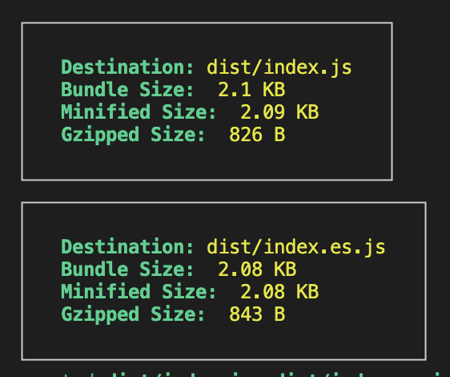

# Rollup.js

This project uses **Rollup.js** – a module bundler for JavaScript – to bundle modern JavaScript modules into a single file that can run in browsers or Node.js.

## 🔍 What is Rollup?

[Rollup](https://rollupjs.org/) is a fast and efficient module bundler that compiles small pieces of code into something larger and more complex, such as a library or application. It's especially good at bundling ES modules (ESM) and is often used for building JavaScript libraries.

- Bundles JavaScript files into a single file.
- Focuses on **ES Modules (ESM)**
- Outputs optimized code (tree-shaking, smaller bundle size).
- Ideal for libraries and modern JavaScript projects.

## 🚀 Why Rollup.js?

- Smaller and faster bundles
- Tree-shaking to remove unused code
- Easy to configure.
- Plugin system for extensibility
- Generates multiple output formats (ESM, CommonJS, UMD, etc.)

## Ideal for

- JavaScript libraries
- NPM Packages
- Modern frontend tooling

## Rollup Configuration vs Webpack

This project includes both Rollup and Webpack configurations for comparison purposes:

### 📁 Configuration Files
- **Rollup**: `rollup.config.mjs` - Simple, focused on library bundling
- **Webpack**: `webpack.config.js` + `webpack.types.config.js` - More complex, application-oriented


### 🚀 Build Commands
```bash
# Rollup
npm run build

# Webpack
npm run build:webpack-all
```


### 🔍 Key Differences



| Feature | Rollup | Webpack |
|---------|--------|---------|
| **Config Complexity** | Simple (115 lines) | Complex (200+ lines) |
| **Bundle Size** | Smaller | Slightly larger |
| **Tree Shaking** | Excellent built-in | Good with config |
| **Learning Curve** | Easy | Steeper |


